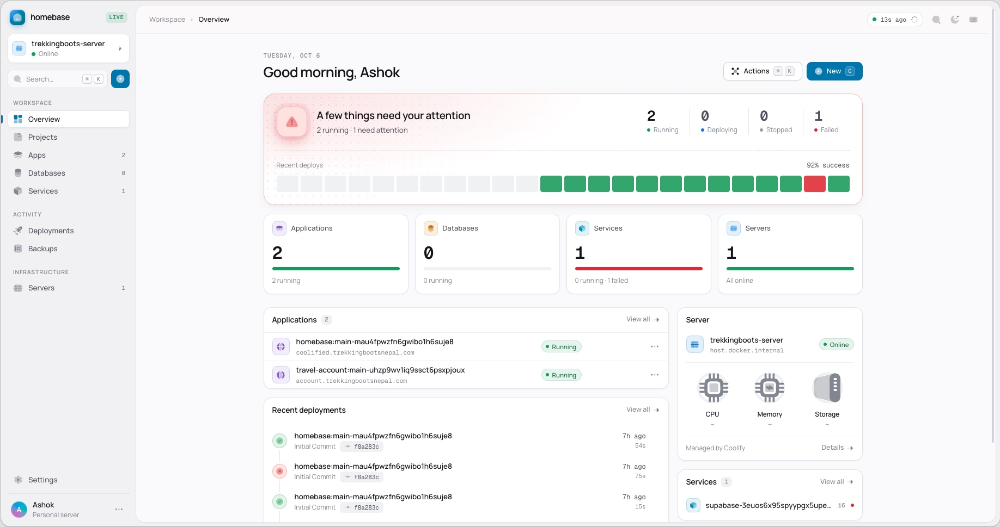

# Homebase

**A calm, beautiful dashboard for your [Coolify](https://coolify.io) server.**

Deploy, read logs, edit environment variables and domains, and create new apps, databases and one-click services from an interface that is easy to use and pleasant to look at. Everything advanced stays one click away in Coolify.

[](LICENSE)



## Highlights

- **Live deployments and logs** with build phases, search, filters and download
- **Create anything**: Git repos, Docker images, Dockerfiles, 8 databases, 350+ one-click services
- **Edit** environment variables (table or `.env`), configuration, domains and redirects, storage and scheduled tasks
- **Keyboard first**: command palette (`⌘K`) and shortcuts for everything (press `?`)
- **Make it yours**: themes, accent colors, fonts, density, terminal themes and one-click looks

## Install on Coolify

Homebase runs happily on the same server it manages.

1. In Coolify, open a project and choose **+ New → Public Repository**.
2. Repository URL: `https://github.com/ashokkasti/homebase`, branch `main`.
3. Build pack: **Dockerfile**. Ports exposes: `3000`. Click **Continue**.
4. **Domains**: set the domain you want, e.g. `https://home.example.com`.
5. **Storages → + Add**: a volume mounted at `/app/data` (keeps your saved connection).
6. **Environment Variables** → _Developer view_, paste and fill in:

   ```env
   HOMEBASE_DEMO=false
   HOMEBASE_ADMIN_EMAIL=you@example.com
   HOMEBASE_PASSWORD_HASH=
   HOMEBASE_SESSION_SECRET=
   HOMEBASE_ENCRYPTION_KEY=
   ```

   Generate the values on any machine with Node and OpenSSL:

   ```sh
   # HOMEBASE_PASSWORD_HASH (use a password of 12+ characters)
   node -e 'const c=require("crypto"),s=c.randomBytes(16).toString("hex");console.log(s+":"+c.scryptSync(process.argv[1],s,64).toString("hex"))' 'your-long-password'

   # HOMEBASE_SESSION_SECRET and HOMEBASE_ENCRYPTION_KEY (run twice)
   openssl rand -hex 32
   ```

7. **Deploy**, open your domain, sign in, and connect your Coolify URL and API token on the setup screen.

**API token:** create one in Coolify under **Keys & Tokens → API tokens** with `read`, `write`, `deploy` and `read:sensitive` (for logs and environment values).

## Other ways to run

**Try the demo** (no server needed, nothing reaches Coolify):

```sh
npm install
npm run dev
```

**Docker Compose:** copy `.env.example` to `.env`, fill it in as above, then `docker compose up --build -d`.

**Node:** `npm run build && npm start` (Node 22+). Serve over HTTPS in production.

You can also skip the setup screen by setting `HOMEBASE_COOLIFY_URL` and `HOMEBASE_COOLIFY_TOKEN`.

If your proxy doesn't send `X-Forwarded-Proto`/`X-Forwarded-Host` and actions fail with _Invalid request origin_, set `HOMEBASE_URL` to your public address (comma-separate several).

## Security

Homebase talks to Coolify server-side, so your API token never reaches the browser. Saved credentials are encrypted (AES-256-GCM), sessions are signed HTTP-only cookies, and destructive actions require typing the resource name. Environment variable values are shown to the signed-in administrator, masked until revealed. Homebase is built for a single administrator.

## Development

```sh
npm run dev        # demo workspace
npm run typecheck
npm test
npm run build
```

Built with Next.js, React, TypeScript, TanStack Query and Zod.

## Contributing

Homebase is open to change. Missing a feature, found a bug, or think something could look or feel better? Please open a pull request with your change — small fixes and big ideas are both welcome.

1. Fork the repo and create a branch.
2. Make your change; if it's a new feature, make it work in the demo workspace too.
3. Run `npm run typecheck && npm test`.
4. Open a pull request describing what changed and why.

Not sure where to start? Open an issue first and we can figure it out together.

## Credits

Unofficial companion app, not affiliated with Coolify. Icons: [Solar](https://www.figma.com/community/file/1166831539721848736) by 480 Design (CC BY 4.0) via [Iconify](https://iconify.design). Fonts: Geist and Google Fonts (OFL).

## License

[MIT](LICENSE) © 2026 Ashok Kasti
